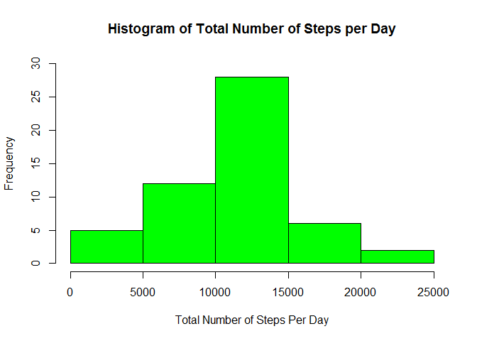
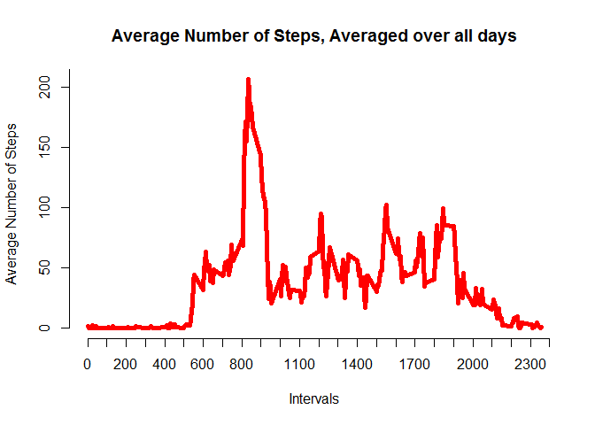
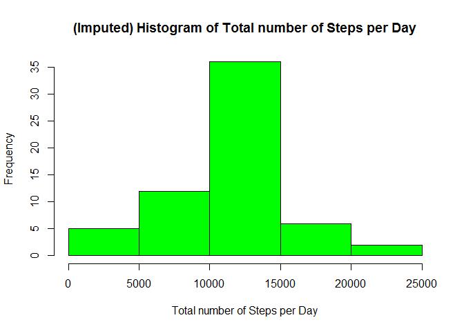
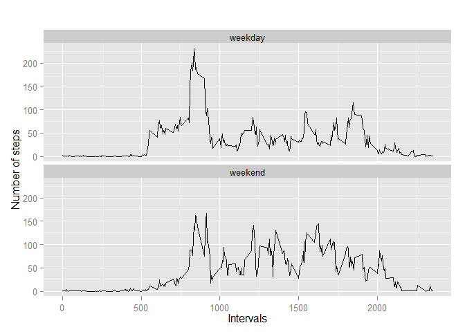

# Reproducible Research: Peer Assessment 1


## Loading and preprocessing the data

```r
# Extract activity.csv into repository folder
# Set working directory to the Repository 
setwd("~/GitHub/RepData_PeerAssessment1")
# Load data
ActivityData <- read.csv(file="activity.csv", header=TRUE, sep=",")
# Remove missing data records
No_NA_Data <- na.omit(ActivityData)
```
## What is the mean total number of steps taken per day?

### 1. Histogram of the total number of steps taken each day

```r
# Summing steps by day
Total_by_day<-aggregate(steps ~ date,No_NA_Data,sum)

hist(Total_by_day$steps, col = "green",
     main ="Histogram of Total Number of Steps per Day", 
     xlab = "Total Number of Steps Per Day", 
     ylim=c(0,30) )
```

 

### 2. Calculate and report the mean and median total number of steps taken per day


```r
# Get mean of total steps per day
Mean_Total_by_day <- mean(Total_by_day$steps)
Mean_Total_by_day
```

```
## [1] 10766
```

```r
# Get median of total steps per day
Median_Total_by_day <- median(Total_by_day$steps)
Median_Total_by_day
```

```
## [1] 10765
```

- The Mean Total number of steps per day is 1.0766 &times; 10<sup>4</sup>.
- The Median Total number of steps taken per day is 10765.

## What is the average daily activity pattern?

### 1. A time series plot (i.e. type = "l") of the 5-minute interval (x-axis) and the average number of steps taken, averaged across all days (y-axis)


```r
# sum steps by interval to get average number of steps in an interval across all days
Mean_Interval_Steps <- aggregate(steps ~ interval, No_NA_Data, mean)

# Create a line plot of the 5-minute interval (x-axis) and the average number of steps taken,
# averaged across all days (y-axis)
xticks <- seq(0, 2400, 100)  # 100 = 1 hour
yticks <- seq(0,250, 50)
plot(Mean_Interval_Steps$interval, Mean_Interval_Steps$steps, type='l', col="red", lwd = 5,
     axes = FALSE, main="Average Number of Steps, Averaged over all days", xlab="Intervals", 
     ylab="Average Number of Steps")
axis(2, at = yticks, labels = yticks)
axis(1, at = xticks, labels = xticks)
```

 

### 2. Which 5-minute interval, on average across all the days in the dataset, contains the maximum number of steps?


```r
# find the maximum average number of steps in an interval
Max_steps <- max(Mean_Interval_Steps$steps)

# find the interval that corresponds to Max_steps
Interval_Max_Steps <- subset(Mean_Interval_Steps, steps== Max_steps)
Interval_Max_Steps
```

```
##     interval steps
## 104      835 206.2
```
Interval 835 has the maximum average number of steps, 206.2

## Imputing missing values
### Note that there are a number of days/intervals where there are missing values (coded as NA). The presence of missing days may introduce bias into some calculations or summaries of the data.

### 1. Calculate and report the total number of missing values in the dataset (i.e. the total number of rows with NAs)


```r
# Create a dataset of rows with NA's
ActivityData_NAs <- ActivityData[!complete.cases(ActivityData),]

# number of rows
nrow(ActivityData_NAs)
```

```
## [1] 2304
```
The Total number of rows with NAs is 2304.

###2. Devise a strategy for filling in all of the missing values in the dataset. The strategy does not need to be sophisticated. For example, you could use the mean/median for that day, or the mean for that 5-minute interval, etc.

I decided that for imputing missing values, to replace each NA by the mean for that 5-minute interval. I already have this data in "Mean_Interval_Steps".

Using SQL it is easy to create a new dataset joining "ActivityData" and "Mean_Interval_Steps" on interval. 
It is then possible to use a case statement to create a new 'steps' column from 'ActivityData.steps' replacing all values that are NA with the corresponding value from 'Mean_Interval_Steps.steps'

###3. Create a new dataset that is equal to the original dataset but with the missing data filled in.


```r
## Using the mean for each 5-minute interval across all day, dataset: Mean_Interval_Steps
library(sqldf)
```

```
## Loading required package: gsubfn
## Loading required package: proto
## Loading required package: RSQLite
## Loading required package: DBI
## Loading required package: RSQLite.extfuns
```

```r
options(sqldf.driver = "SQLite")

UpdatedActivityData <- sqldf("select a.interval, a.date, 
                             case when a.steps is null 
                             then b.steps else a.steps end as steps   
                             from ActivityData a join Mean_Interval_Steps b using (interval)")
```

```
## Loading required package: tcltk
```

### 4a. Make a histogram of the total number of steps taken each day and Calculate and report the mean and median total number of steps taken per day. 


```r
# aggregate steps by per date to get total number of steps in a day
Total_by_day_imputed <- aggregate(steps ~ date, UpdatedActivityData, sum)

# create histogram of total number of steps in a day
hist(Total_by_day_imputed$steps, col = "green", 
     main = "(Imputed) Histogram of Total number of Steps per Day", 
     xlab="Total number of Steps per Day")
```

 

### Calculate and report the mean and median total number of steps taken per day


```r
# Get mean of total steps per day
Mean_Total_by_day_imputed <- mean(Total_by_day_imputed$steps)
Mean_Total_by_day_imputed
```

```
## [1] 10766
```

```r
# Get median of total steps per day
Median_Total_by_day_imputed <- median(Total_by_day_imputed$steps)
Median_Total_by_day_imputed
```

```
## [1] 10766
```
- The Mean Total number of steps per day is 1.0766 &times; 10<sup>4</sup>.
- The Median Total number of steps taken per day is 1.0766 &times; 10<sup>4</sup>.

### 4b. Do these values differ from the estimates from the first part of the assignment?
Data with the NA's removed:

- The Mean Total number of steps per day is 1.0766 &times; 10<sup>4</sup>.

- The Median Total number of steps taken per day is 10765.

Data with the NA's replaced by the mean per interval:

- The Mean Total number of steps per day is 1.0766 &times; 10<sup>4</sup>.

- The Median Total number of steps taken per day is 1.0766 &times; 10<sup>4</sup>.

### 4c. What is the impact of imputing missing data on the estimates of the total daily number of steps?

Comparing the imputed dataset with the one with the NA's removed, the mean values have stayed the same while the median value of the imputed dataset has increased to the same value as the mean.

## Are there differences in activity patterns between weekdays and weekends?

### Use the dataset with the filled-in missing values for this part.

### 1. Create a new factor variable in the dataset with two levels - "weekday" and "weekend" indicating whether a given date is a weekday or weekend day.


```r
# Using SQL to create the new dataset:
# Add a column, type_day, which will have 'weekday' or 'weekend'
# get the mean (average) of the steps by interval and type_day to get average number of steps in an interval across all days

IntervalStepsByDayType <- sqldf("select a.interval, 
                                case when cast (strftime('%w', a.date) as integer) in (0,6)  
                                then 'weekend' else 'weekday' end as type_day, 
                                avg(a.steps) as steps 
                                from UpdatedActivityData a 
                                group by a.interval, 
                                type_day") 
```


### 2. Make a panel plot containing a time series plot (i.e. type = "l") of the 5-minute interval (x-axis) and the average number of steps taken, averaged across all weekday days or weekend days (y-axis). An example was provided.


```r
# Create a panel plot for weekdays and weekends
library(ggplot2)

qplot(interval, steps, data=IntervalStepsByDayType, geom = c("line"), xlab = "Intervals", 
      ylab="Number of steps", main="") + facet_wrap(~ type_day, ncol=1)
```

 

In conclusion there are differences between week days and weekends: 

- a higher number of steps between Intervals 1000 and 2000 over weekends.

- while there are a higher number of steps between Intervals 500 and 900 during the week days.
